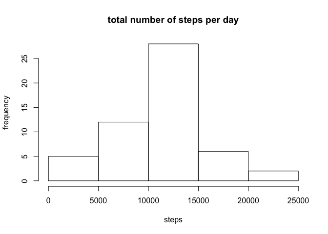
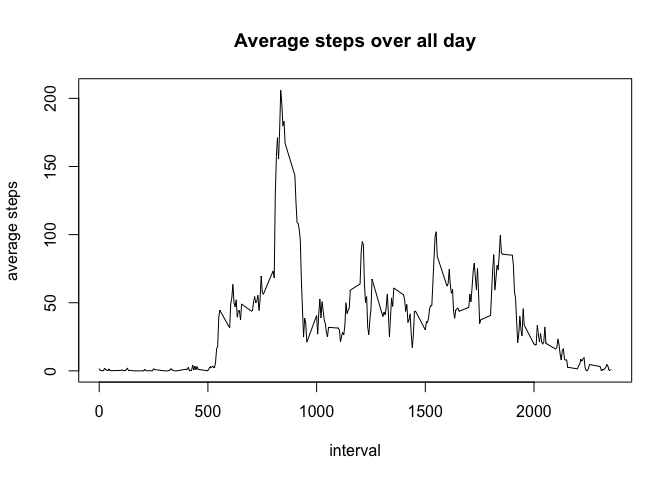
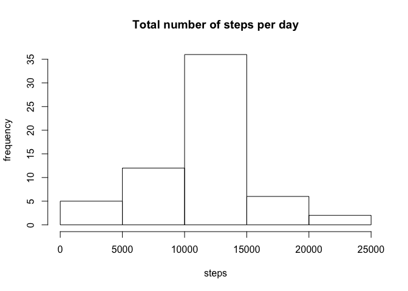
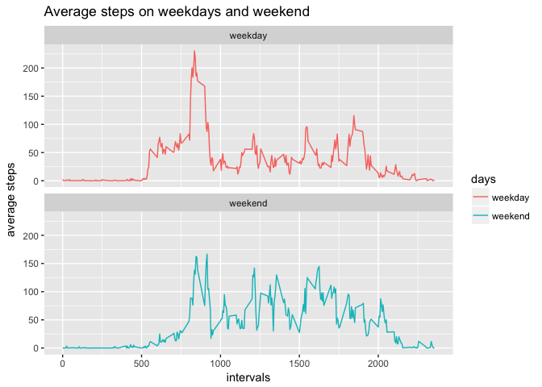

Loading required libraries

```r
library(knitr)
library(dplyr)
```

```
## 
## Attaching package: 'dplyr'
```

```
## The following objects are masked from 'package:stats':
## 
##     filter, lag
```

```
## The following objects are masked from 'package:base':
## 
##     intersect, setdiff, setequal, union
```

```r
library(ggplot2)
```

## Loading and preprocessing the data

```r
setwd("/Users/silencemac/Desktop/coursera/course5.2")
activity <- read.csv("activity.csv", sep = ",")
activity$date <- as.Date(activity$date)
```

```
## Warning in strptime(xx, f <- "%Y-%m-%d", tz = "GMT"): unknown timezone
## 'zone/tz/2018c.1.0/zoneinfo/Europe/Berlin'
```

## What is mean total number of steps taken per day?

```r
byday <- aggregate(steps ~ date, activity, sum)
hist(byday$steps, xlab = "steps", ylab = "frequency", 
     main = "total number of steps per day")
```

<!-- -->

```r
summary(byday)
```

```
##       date                steps      
##  Min.   :2012-10-02   Min.   :   41  
##  1st Qu.:2012-10-16   1st Qu.: 8841  
##  Median :2012-10-29   Median :10765  
##  Mean   :2012-10-30   Mean   :10766  
##  3rd Qu.:2012-11-16   3rd Qu.:13294  
##  Max.   :2012-11-29   Max.   :21194
```

## What is the average daily activity pattern?


```r
byinterval <- aggregate(steps ~ interval, activity, mean)
plot(byinterval$interval, byinterval$steps, type = "l", xlab = "interval",
     ylab = "average steps", main = "Average steps over all day")
```

<!-- -->

Which 5-minute interval contains the maximum number of steps?

```r
maxsteps <- which.max(byinterval$steps)
byinterval[maxsteps,]
```

```
##     interval    steps
## 104      835 206.1698
```

## Imputing missing values

```r
NAsum <- sum(is.na(activity))
paste("The number of missing values in the dataset is", NAsum)
```

```
## [1] "The number of missing values in the dataset is 2304"
```

Devise a strategy for filling in all of the missing values in the dataset

```r
fillact <- activity
NAact <- is.na(fillact$steps)
mean.interval <- tapply(fillact$steps, fillact$interval, mean, 
                        na.rm = TRUE, simplify = TRUE)
```

Create a new dataset with the missing data filled in

```r
fillact$steps[NAact] <- mean.interval[as.character(fillact$interval[NAact])]
```

Make a histogram of the total number of steps taken each day

```r
byday.NA <- aggregate(steps ~ date, fillact, sum)
hist(byday.NA$steps, xlab = "steps", ylab = "frequency", 
     main = "Total number of steps per day")
```

<!-- -->

```r
m2 <- mean(byday.NA$steps)
md2 <- median(byday.NA$steps)
m1 <- mean(byday$steps)
md1 <- median(byday$steps)
paste("The mean and median total number of steps taken per day are", m2, "and", md2)
```

```
## [1] "The mean and median total number of steps taken per day are 10766.1886792453 and 10766.1886792453"
```

```r
paste("In the first part, the mean and median total number of steps taken per day are", 
      m1, "and", md1)
```

```
## [1] "In the first part, the mean and median total number of steps taken per day are 10766.1886792453 and 10765"
```

## Are there differences in activity patterns between weekdays and weekends?

```r
fillact$date2 <- weekdays(fillact$date)
fillact$days[fillact$date2 %in% c("Saturday", "Sunday")] <- "weekend"
fillact$days[fillact$date2 %in% c("Monday", "Tuesday", "Wednesday", 
                                 "Thursday", "Friday")] <- "weekday"
byinteral_days <- aggregate(steps ~ interval + days, fillact, mean)
g <- ggplot(byinteral_days, aes(interval, steps, color=days))
p <- g + geom_line() + labs(x = "intervals", y = "average steps", 
                            title = "Average steps on weekdays and weekend") + 
       facet_wrap(~ days, ncol = 1)
print(p)
```

<!-- -->
